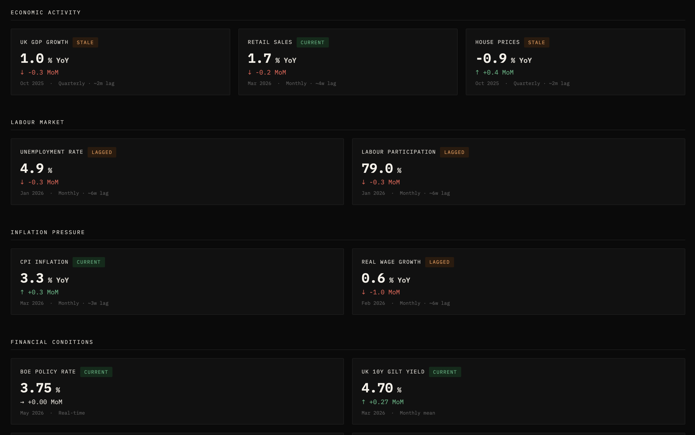
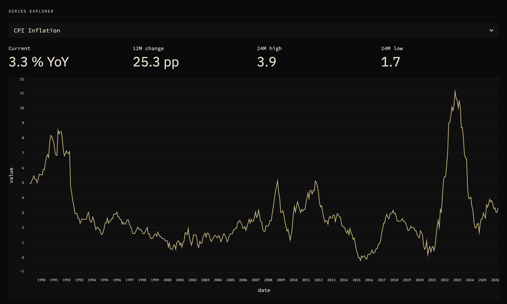
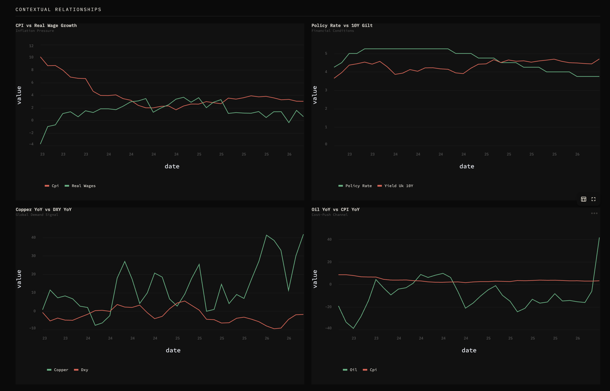

# UK Economic Pulse

A macro intelligence dashboard that answers one question: **is the UK economy strengthening or weakening right now?**

Built for people who want signal, not noise. Every number shown is there because it tells you something the others don't.

https://uk-economic-pulse.streamlit.app/

---

## Screenshots

**Scorecards — current readings with MoM direction and data freshness**


**Series Explorer — full history for any indicator**


**Contextual Relationships — the pairs that tell the real story**


---

## What it does

Pulls UK macro data from FRED, ONS, and yfinance. Aligns everything to a monthly backbone. Presents current readings, month-on-month direction, and 36-month trend sparklines — grouped into six economic forces.

No composite index. No black box scoring. Just the data, clearly labelled, with the relationships that matter surfaced explicitly.

---

## The six forces

| Category | What it tells you |
|---|---|
| **Economic Activity** | Whether the economy is growing — GDP, retail sales, house prices |
| **Labour Market** | Whether workers have power — unemployment, participation rate |
| **Inflation Pressure** | Whether prices are still running hot — CPI, real wage growth |
| **Financial Conditions** | Whether credit is tight or loose — policy rate, gilt yields, yield curve, HY spreads |
| **Commodities** | Whether input costs are rising and global demand is holding — oil, copper, gas, gold |
| **Markets** | Forward-looking demand and risk sentiment — semiconductors (SOX), US dollar (DXY) |

---

## Repo structure

```
uk-economic-pulse/
│
├── data/
│   └── raw/
│       ├── absolute_values.csv   # Price levels and index values, monthly
│       └── signals.csv           # Transformed signals (YoY %, levels, spreads)
│
├── notebooks/
│   ├── 01_data_pull.ipynb        # Pull from FRED, ONS, yfinance → CSVs
│   ├── 02_cleaning.ipynb         # Data quality checks, coverage report
│   ├── 03_dashboard.ipynb        # Step-by-step dashboard build and validation
│   └── 04_composite.ipynb        # Composite scoring (in development)
│
├── app.py                        # Streamlit dashboard
├── requirements.txt              # Python dependencies
├── .streamlit/
│   └── config.toml               # Dark theme configuration
├── docs/
│   └── screenshots/              # Dashboard screenshots for README
└── README.md
```

---

## Quickstart

**1. Clone and install**

```bash
git clone git clone https://github.com/crashed-bandicoot/uk-economic-pulse.git
cd uk-economic-pulse
pip install -r requirements.txt
```

**2. Get a FRED API key**

Free registration at [fred.stlouisfed.org](https://fred.stlouisfed.org/docs/api/api_key.html). Takes two minutes.

**3. Pull the data**

Run `01_data_pull.ipynb` in full. This writes `absolute_values.csv` and `signals.csv` to `data/raw/`. Expect it to take 60–90 seconds — it hits FRED, the ONS website, and yfinance.

**4. Run the dashboard**

```bash
streamlit run app.py
```

Open [http://localhost:8501](http://localhost:8501). Enter your FRED API key in the UI (for a live pull) or point it at your local CSVs.

---

## Data sources

| Series | Source | Frequency | Notes |
|---|---|---|---|
| UK GDP | FRED `NGDPRSAXDCGBQ` | Quarterly | ~2 month release lag |
| House Prices | FRED `QGBR628BIS` | Quarterly | BIS residential property index |
| Retail Sales | ONS (live HTTP) | Monthly | Volume index, seasonally adjusted |
| CPI | FRED `GBRCPIALLMINMEI` | Monthly | All items |
| Real Wages | FRED `LCEAMN01GBM661S` | Monthly | Nominal; YoY computed |
| BoE Policy Rate | FRED `BOESRPPACBIS` | Monthly | |
| UK 10Y Gilt | FRED `IRLTLT01GBM156N` | Monthly | OECD via FRED |
| UK 3M Rate | FRED `IR3TIB01GBM156N` | Monthly | For yield curve calculation |
| Unemployment | FRED `LRUNTTTTGBM156S` | Monthly | |
| Labour Participation | FRED `LFAC64TTGBQ647S` | Quarterly | |
| US HY Spread | FRED `BAMLH0A0HYM2` | Daily | Available from 2023 only |
| Brent Oil | FRED `DCOILBRENTEU` | Daily | Monthly mean |
| Gold, Copper, Gas, SOX, DXY | yfinance | Daily | Monthly mean |

---

## Signal conventions

**YoY % change** is used for index and price series where the level is arbitrary (GDP, house prices, CPI, commodities). It tells you how fast things are moving relative to a year ago.

**Levels** are kept for series where the number itself is meaningful (policy rate at 4.5%, unemployment at 4.2%, yield curve at -0.3pp).

**MoM delta** on the scorecards is the change in the signal value from the prior month's reading — so for a YoY series, it's the acceleration or deceleration, not the raw price move.

---

## Interpretation notes

- **Yield curve (10Y − 3M):** negative = inverted. Inversion has preceded every UK and US recession since the 1970s, typically by 6–18 months.
- **Copper YoY:** global industrial demand barometer. Copper falling while the dollar rises is a global slowdown signal.
- **Real wages vs CPI:** when real wage growth exceeds CPI, purchasing power is recovering — consumption support.
- **HY credit spread:** rising spreads mean credit markets are pricing in more default risk. A sharp move above 500bp is a stress signal.

---

## Roadmap

- [ ] Composite scoring layer (weighted z-score across forces)
- [ ] Automated interpretation bullets via LLM
- [ ] LinkedIn post draft generator from latest readings
- [ ] Streamlit Community Cloud deployment
- [ ] GitHub Actions scheduled data refresh

---

## Methodology

This is a **nowcast-style signal tool**, not a forecasting model. It tells you where the economy is right now based on the latest available data, with explicit lag disclosures per series. It is not investment advice.

The design principle throughout: every number shown must justify its presence. If two indicators say the same thing, one gets cut.

---

*Data: FRED / ONS / yfinance — for informational purposes only*
